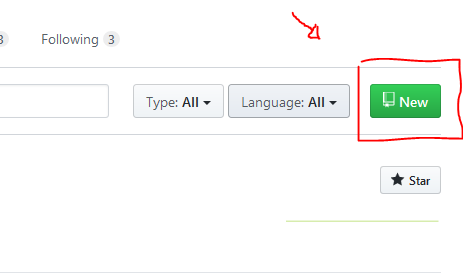
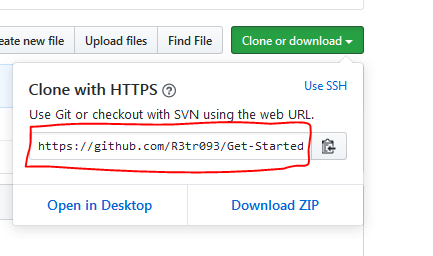

# Premier pas avec Git

## Initialiser les tous !
Pour qu'un dossier puisse être traiter par github il faut qu'il sois initialiser, quand on initialise un dossier cela crée à l'intérieur un dossier .git, c'est grâce à ce dossier que vous pourrez utiliser les capacités de github.

Si un dossier ou ces racines ascendante ne contient pas de dossier .git vous ne pourrez pas utiliser github.

Lorsque qu'un repository est créer depuis github, il contient automatiquement et forcément un dossier .git

Une bonne pratique est de créer un dossier qui va contenir vos projets sur git, vous pouvez l'appelez GIT par exemple.

Maintenant avec votre toute première commande vous allez initialiser ce dossier, depuis votre terminal.

Naviguer dans votre arborescence vers le dossier cible et lancez la commande suivante ::

* git init 

Et voilà, votre dossier à été initialiser.

## Clone moi si tu peux !

La première étape consiste à créer un repository depuis github.

Pour cela rendez vous dans le menu en cliquant sur votre avatar et sélectionner :: your repositories.

Depuis cette page vous trouverez un bouton new, cliquez dessus.

Vous pourrez créer un repository en y créant un fichier README.md, lors de la création si vous le désirez.

Si tel est le cas, cocher la case " Initialize this repository with a README ".

Un fichier avec l'extension md ( markdown ) est un fichier qui vous permet d'éditer un texte avec certaines fonctionnalités comme insérer un lien, une image, un titre, etc...

Une fois votre repository créer, cliquez le bouton clone or download, vous aurez alors un code qui vous suffira de copier dans votre terminal.

Rendez vous dans le dossier dans lequel vous souhaiter stocker votre repository, ensuite entrez la commande suivante :

* git clone votreLienGitHub 

Ceci aura pour effet de créer un clone du repository qui se trouvait sur gitHub dans le dossier à partir du quelle vous avez entrer la commande.

Bien joué, vous avez créer votre premier clone. 

## Modifier, commentez !

Vous allez maintenant effectuer votre travail sur votre repository, une fois votre travail achevé vous pourrez laissez un commit.

Un commit est similaire à un commentaire, il permet de garder un oeil sur les modifications apportez à  votre repository.

Grâce aux commits vous saurez gardez une trace de vos modifications, pour faire un commit entrer la commande suivante

* git commit -m " Correction du bug." 

Le commit est maintenant accessible sur github, mais aussi depuis votre terminal.

Idéalement un commit est cours et précis, de cette maniére un rapide coup d'oeil vous indiquera en quelques mots le travail effectuer.

Les commits conservent la date du commit, un commentaire, un SHA ( l'identifiant du commit), son auteur et son adresse mail github.

Pour voir les commits effectuer sur une branche, vous pouvez utilisez la commande suivante ::

* git log 

Cette commande va afficher tout les commits effectuer sur la branche.

## Ajoutez, pushez !

Une fois que vous avec modifier un fichier, et que vous avez commentez votre travail avec un commit, il ne vous reste plus qu'a envoyer votre travail depuis votre terminal vers le repository sur github.

Avant de pouvoir pushez votre dossier avec les modifications vers votre repository, il va falloir ajouter les fichiers que vous avez modifier pour faire ceci vous allez avoir besoin d'une nouvelle commande :

git add monFichier.txt

Si vous avez beaucoup de fichiers, utilisez plutot la commande 

* git add . 

En ajoutant un . plutot que le nom d'un fichier le terminal ajouteras alors tout les fichiers.

Cette commande va ajouter ce fichier vers le  dossier .git, félicitation votre fichier est prêt à être pushez.

Pushez signifie que votre vous allez envoyer votre dossier vers votre son repository sur github, une dernière commande ( oui encore ) :

* git push 

Cette commande envoye le dossier courant vers github, pour autant que vous soyez en droit de le faire bien sur.

Attention si vous tentez un push sur un dossier qui contient des sous dossiers dans lequel des fichiers n'ont pas été ajouté avec la commande git add

Il peut y avoir plusieurs raisons qui empêchent les commandes comme push de s'exécuter, mais pas de panique nous allons voir cela plus tard.vous aurez une erreur critique, de la même manière que si vous avez des sous dossiers dans le dossier que vous pusher depuis votre terminal qui n'existe pas dans le repository vous aurez une erreur critique.

Bravo, vous savez maintenant ajouter un fichier depuis votre ordinateur vers son repository github !

<!-- INSERER CONCLUSION DE FIN ? -->

