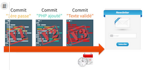

# Tutoriel Github Hamilton 2.12

Hello, c'est l'équipe Hamilton 2.12

Vous êtes sur un repository qui va vous guider dans l'utilisation de GitHub.

## Introduction

Git , est un outil qui permet de versionner votre code , c'est à dire gérer les versions de votre code au fur et à mesure que vous les modifiez .

Pourquoi versionner votre code ?

Lorsque vous travaillez sur un projet de en développement, vous allez régulièrement y apporter des modifications , et par moments ces modifications vont provoquer des bugs .

Lorsque vous revenez sur votre projet après quelques jours ou même quelques heures , il peut être difficile de vous souvenir des derniéres modifications que vous avez effectuées et de retrouver vos repères dans votre code .

Avec un logiciel de versionning comme Git , vous pouvez garder la trace de toutes les modifications faites sur votre code pour pouvoir vous y retrouver à tout moment.

A chaque fois que vous faites une série de modifications, ( créer un fichier, supprimer un fichier, modifier une ligne dans un fichier, etc ...) vous allez pouvoir enregistrer ces modifs dans un commit .

Schéma de commits :

Un commit correspond à une version de votre code , à un instant donné .

La somme de tous les commits constitue l'historique de votre projet. Et l'intérêt d'un logiciel de versioning comme Git, c'est que vous pouvez vous placer à n'importe quel endroit de cette historique.

En cas de bug par exemple, ou lorsque vous êtes plusieurs à travailler sur un même projet , revenir en arrière sur une précedente version du code peut s'avérer très utile .

<!-- TODO :: Insérer une introduction sur l'utilité de git. -->

<!-- ( Peut être inutile.) Insérer guide d'installation ( windows, mac, Linux) -->
